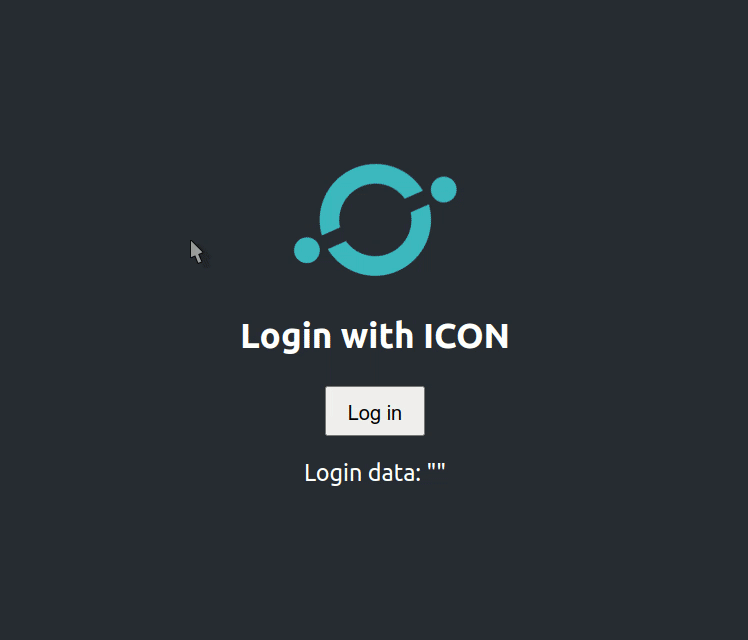

# ICON-login (React Component)

**ICON-login** is a react component that allows for user login based on ICON wallet addresses. It supports login via ICONex /Hana wallets and ledger devices.

More details on how to use the component will be published in the future, for now you can read the code in [LoginModal.js](./src/components/LoginModal/LoginModal.js) to figure it out, basically import the `LoginModal` component in your app as a login button.

## Available Scripts

This project was bootstrapped with [Create React App](https://github.com/facebook/create-react-app). You will be able to use the standard `create-react-app` scripts.

* `npm start`

* `npm test`

* `npm run build`

* `npm run eject`
